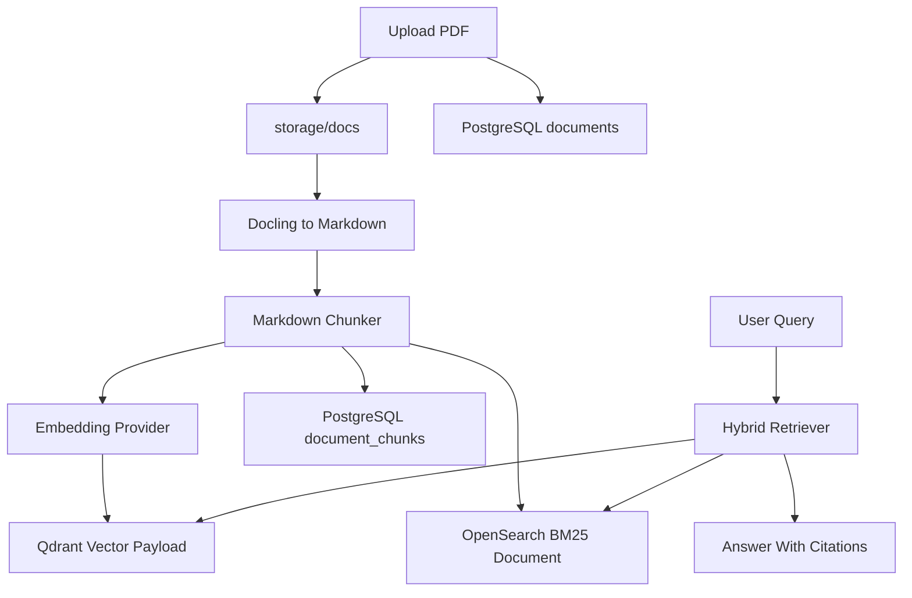

# Architecture

## Data Ownership

This project follows a production-style RAG storage split:

- PostgreSQL stores business data.
- Qdrant stores vector-searchable chunk payloads.
- OpenSearch stores keyword-searchable chunk text.
- Local filesystem storage keeps the raw source files.

The same chunk text is intentionally stored in Qdrant and OpenSearch. Retrieval can return
ready-to-use context without an extra PostgreSQL lookup for every chunk hit.

## Document Lifecycle

## PostgreSQL

`documents` contains metadata about original files:

- title
- original filename
- MIME type
- local file path
- status
- owner/category placeholders
- version and timestamps

`document_chunks` maps business metadata to retrievable chunk IDs:

- document ID
- chunk ID
- chunk index
- title, section, page
- checksum and token count
- Qdrant point ID
- OpenSearch document ID

It does not store the full chunk text. Qdrant and OpenSearch own the retrievable copy.

`ingestion_jobs` tracks pipeline progress and failures.

## Qdrant Payload

Each Qdrant point uses the stable chunk ID as its point ID and stores:

- vector
- document ID
- chunk ID
- chunk text
- title
- section
- page
- checksum

## OpenSearch Document

Each OpenSearch document uses the same stable chunk ID and stores:

- chunk text
- title
- section
- page
- document ID
- checksum

## Retrieval

The backend embeds the query for vector search and sends the raw query to keyword search.
The hybrid retriever normalizes scores from both backends, applies configurable weights,
deduplicates by chunk ID, and returns cited chunks.

When an LLM endpoint is not configured, the API returns the most relevant local chunks as a
fallback answer. This keeps local smoke tests deterministic.
